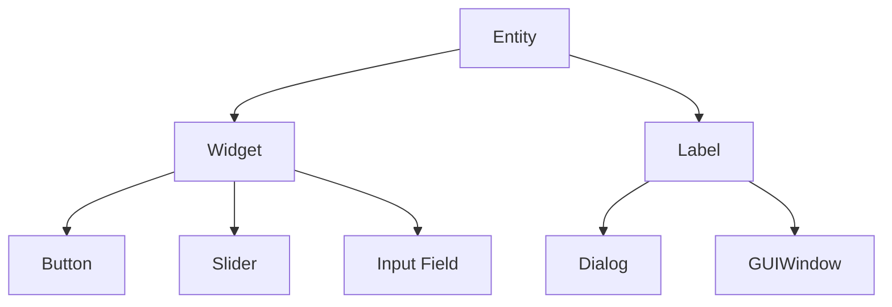

# GUI
Just a *System* that is added by default to the *Scene*. It handles every spawned *Widget* object.
## Class hiearchy

```mermaid
graph TD
-1[Entity] --> 0[Widget]
0 --> 1[Button]
0 --> 2[Slider]
0 --> 3[Input Field]
-1 --> 4[Label] 
4 --> 5[Dialog]
4 --> 6[GUIWindow]
```