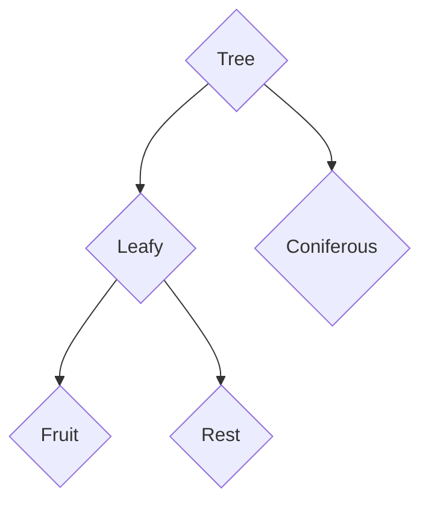
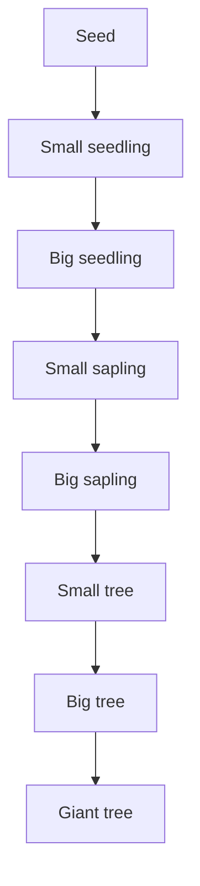

# Tree Tycoon
# Overview
## Genre
Tycoon, I've taken inspiration from Game Dev Tycoon.
## Target Audience
*Humans*, aged from 13 up. They have to know about how to use a computer. 
## Game concept
Player is managing a tree nursery. He has to buy trees, sell them and what they have and buy more plots. Player has to take care of them and watch out for random events. 
## Story
You derived a small tree nursery from a distant aunt. Take care of it. And by the way - you have financial problems and few loans to pay. Good luck!
# Elements
## Trees
### Categories chart

### Species
* *Coniferous*:
	* Pine
* *Leafy - Fruit*:
	* Apple
* *Leafy - Rest*:
	* Oak
### Growing chart

### Growing notes
Time between current stage and next stage is **2x** longer than between previous and current.
**Small sapling** - low chance for seeds (and fruits)
**Big sapling** - 100% for seeds (and fruits) from this time. Every next stage - **2x** more seeds (or fruits)
### Taking care
Depends on how big the tree is (the bigger ones don't need to be watered) and what type they are (maybe some type of tree doesn't need fertile soil?). Basic ways:
* Fertilization (natural or chemical)
* Watering
* Spraying against pests
## Plots
Just a field for the trees. One slot in plot - one tree (*idea - if tree is very big then it affect neighbour slots). Bigger plot - more expensive. Can be sold.
## Economy
In-game currency - *Sollars*, $.
### Selling
* Seeds (or fruits)
* Small and Big seedlings
* Wood for planks, as building material (Small/Big/Giant trees)
* Plants
### Buying
See above (except wood ofc.).
## Random Events
* Drought
* Arson (by someone or because *Drought*)
* Plague
* Flood
* Too many chemicals used for fertilization (*Easter Egg: use chemical fert. 8 times, enter Konami Code. Ent will appear, small chance that will rebel other trees and destroy whole plot.*)
# Interface
## Menu
## Pause
## Playing scene
## Other...
# Technicals
See: `Technicals.md`.
<!--stackedit_data:
eyJoaXN0b3J5IjpbLTEwODgzNzk3OTddfQ==
-->