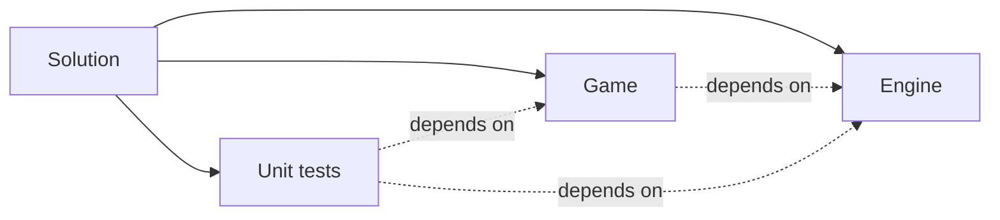

# Technicals
## Projects in VS

## Modules
Code is splitted into fragments - *Modules*. Every module is doing its own job, but very often it'll depend on other modules. There are several layers of abstraction - from general concept to more specific components.
### Engine
#### List of modules
* Visual
    * Assets 
    * Renderer
        * Objects, that can be drawn
        * Drawing on screen
    * Animation
* Input
* Gameplay objects (?) 
    * Actor
    * Pawn
    * Scene
* Window
* Audio 
* UI
    * Basic widgets, sliders
* Game (main class)
#### Notes
The *Window* has to handle *Input* updates and *Renderer* drawing - they have to communicate.
Use *Gameplay object* in *UI*.
### Game
* World
    * Random events 
    * Plots
        * Trees
* Economy
    * Buy / Sell
 
# Misc ideas
Let trees have a seasonChange method:
```cpp
Tree::seasonChange( Season season_ )
{
    if (season_ == Season::Winter)
        // Change texture to winter, lock ability to sell fruits or something
}
```