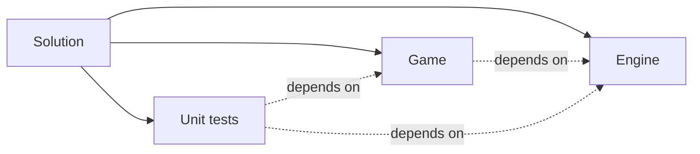

# Technicals
## Projects in VS

## Namespaces
Whole *Engine* part is in `con`, however the internal globals and classes are also in `priv`. The *Game* has no namespace.
## Modules
Code is splitted into fragments - *Modules*. Every module is doing its own job, but very often it'll depend on other modules. There are several layers of abstraction - from general concept to more specific components.
### Engine
#### List of modules
* Utility
    * RNG functions
* Debug
    * Logging
* IUpdatable
* Assets
    * Audio
        * Music, Sound
    * Texture
    * Settings
* Visual
    * Renderer
        * Objects, that can be drawn
        * Drawing on screen
    * Animation
* Input
* Gameplay objects 
    * Entity
    * Scene
* Window
* Audio 
* UI
    * Basic widgets, sliders
* Global communicator  (Messenger?)
* Game (main class)
    * States 
#### Notes
The *Window* has to handle *Input* updates and *Renderer* drawing - they have to communicate.
Use *Gameplay object* in *UI*.
The *Utility* also contains everything that will come up during programming, like `convertTo<T>( x )` function.
### Game
* Saving a scene, player stats etc.
* World
    * Random events 
    * Plots
        * Trees
* Economy
    * Buy / Sell
### Unit tests
* Interface 
# Misc ideas
* Make priority hiearchy, what children of IUpdatable update first
* The 'internal' methods starts with underscore, eg. `Input._dispatchEvent( event )`.
* Use *Filters* in IDE to distinguish modules; don't make folders - make filters. 
 * Let trees have a seasonChange method:
```cpp
Tree::seasonChange( Season season_ )
{
    if (season_ == Season::Winter)
        // Change texture to winter, lock ability to sell fruits or something
}
```
* No need to name global object's classes, just do that:
```cpp
// .hpp
struct 
{
} extern MyGlobal;
// .cpp
inline decltype(MyGlobal) MyGlobal{};
```